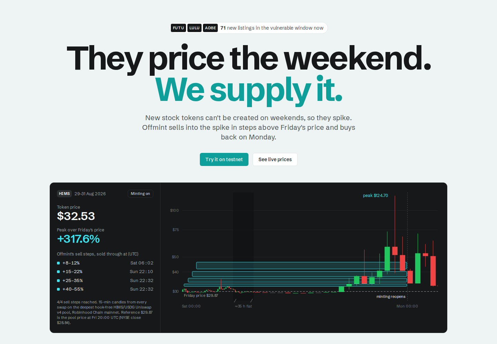
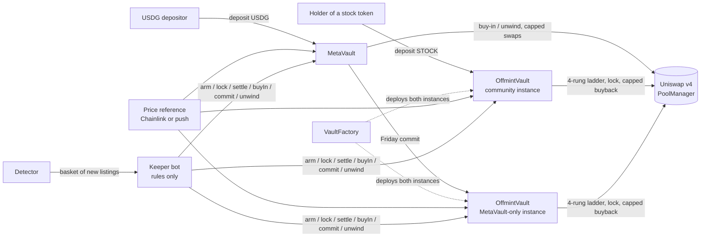

<p align="center"></p>

# Offmint: they price the weekend, we supply it

**New Robinhood stock tokens can't be created on weekends, so they spike. Offmint sells into the spike in steps above
Friday's price and buys back on Monday.** On 29 Aug 2026 HIMS traded **+317.6%** above its Friday reference while
minting was off.

<p align="center"></p>

**Live:** [the site](https://offmint-web.offmintfinance.workers.dev) · [paper mode on mainnet, every weekend](https://offmint-keeper-production.up.railway.app/paper/index.json) ·
[contracts on Blockscout (testnet)](https://explorer.testnet.chain.robinhood.com/address/0x2ea8dF9feA9DDEBb0abf774aE46E1DFF9a6E4285) ·
[latest CI](https://github.com/offmint/offmint/actions) · **Unaudited. Testnet only.**

## In plain English
On weekends and US market holidays nobody can create new Robinhood stock tokens, so a token can trade far above the
real share price. **Offmint's community vault** offers some of your tokens for sale only above that real price, then buys
them back after Monday's reopen, never paying more than the fresh price + 1%. The difference is extra tokens for you.

1. **Connect** a wallet on Robinhood Chain testnet.
2. **Deposit** stock tokens you already hold (no new exposure: you held them anyway; no deposit fee).
3. **Withdraw** any weekday. After a weekend where the token spiked, you can get back more tokens than you put in.

What it would have done, per $1,000 of tokens deposited (**simulated** on real weekend swaps with our own orders in the
pool, excluding LP fee income, after the 10% fee on profit; `web/public/data/supply/replay.json`):

| | |
|---|---|
| A big spike weekend | **+3.8% (HIMS, 29 Aug) to +7.1% (GLXY, 12 Sep)**; on 1 of these 3, part of the buyback was still waiting on Monday (valued at the cap) |
| A normal weekend | **about 0%**: nothing sells (191 of 198 ticker-weekends screened) |
| The worst weekend we replayed | **−0.1%** (NU, 12 Sep), mostly the gas we charge each weekend ($1 per $1,000) |
| Fee | **10% of profit**, nothing otherwise |
| Capacity today | **about $1,647 per pool** can be bought back on Monday within the 1% cap (middle of 5 weekends where the cap was reached; range $0 to $5,198) |

**The risk:** if the real stock rises by Monday, the capped buyback can't get every sold token back, so you can end with
fewer tokens than you deposited (in the stress test, one squeeze weekend ended −0.49%). Past weekends don't predict the
next one. **MetaVault** (deposit dollars instead of tokens) is **experimental, coming later**: its weekly picker, replayed
with only the data it would have had, did not pick HIMS before the 29 Aug spike.

**Try it** (on the site): `/sandbox` (one weekend step by step in your browser, no wallet) · `/weekends` (weekend
report) · `/vault/HIMS` (vault on testnet) · `/sell` (personal sell order, testnet).

> **Unaudited. Testnet only** (Robinhood Chain testnet, 46630). Not available to US persons. Offmint is an independent
> project, not affiliated with or endorsed by Robinhood or the Arbitrum Foundation. Every number below names its source
> and says whether it is measured, simulated or live.

## The problem
On weekdays a stock token's price stays honest: if it trades above the real share, traders create new tokens at the real
price and sell them. On weekends that loop is switched off. Our screen of every Robinhood stock token over 8 weekends
(Uniswap v4 swap logs, 1 Aug – 19 Sep 2026) found two newly listed tokens without a Chainlink feed that spiked:

| Token | Weekend | Peak over Friday's close |
|---|---|---|
| HIMS | Sat 29 Aug 2026 | **+317.6%** |
| GLXY | Sat 12 Sep 2026 | **+186.1%** |

MSTR, which **has** a Chainlink feed, spiked **+243.31%** the same weekend as HIMS (checked against the Chainlink
feed: the pool traded at parity on Thursday, Friday and Tuesday, +25% Saturday, +103% Sunday, back to parity Monday).
A Chainlink feed doesn't make a token immune: in 12 mint-off windows (3 Jul to 19 Sep), a token held more than 10% above
its reference for an hour or more 19 times, 16 on tokens without a feed (LMT +53.5% on 5 Sep, for 13.2 h) and 3 on tokens
with one (MSTR twice, RKLB once; from the [weekend report](web/public/data/weekends.json), premium held 15 min vs the
official close; feed list from Chainlink's directory, [feeds.json](web/public/data/feeds.json)). The largest names
(NVDA, TSLA, AAPL, SPY) never went above 2.6%. Squeezes are rare per ticker and recur across the
basket, which is why Offmint works from a live basket (a detector rebuilds it every 6 hours) instead of a fixed list.
Reference: the Chainlink close where a feed exists, otherwise the pool price at Fri 20:00 UTC. Data: `web/public/data/screen/weekends.json`.

## Why it is structural
New tokens can only be created while the underlying share can be bought: Robinhood's tokenization window runs Monday
02:00 to Saturday 02:00 CET/CEST and is closed on US market holidays; outside it, minting and burning are not supported
while trading continues onchain ([Robinhood Chain docs](https://docs.robinhood.com/chain/stock-tokens/),
[About Stock Tokens](https://robinhood.com/eu/en/support/articles/about-stock-tokens)). Even if those hours grow,
weekends, holidays and trading halts remain.

## What Offmint does
1. **Friday: post the ladder.** When token creation closes, the vault posts four one-sided Uniswap v4 range orders
   above Friday's price: +8–12%, +15–22%, +25–35%, +40–55%. Nothing sells unless buyers pay more than Friday's price.
2. **Weekend: sell only into a spike.** A fully sold step is pulled at once, so its dollars cannot be bought back on
   the way down.
3. **Monday: buy back, capped.** With a fresh post-reopen price, the vault buys the stock back, never above that
   price + 1%. If Monday opens higher, it buys what it can and retries instead of chasing.

The contracts call the Uniswap v4 PoolManager directly (`unlock` + callback). A rules-based keeper bot calls `arm` and
`settle`; anyone can call them after a grace period if the keeper stops. Neither the owner nor the keeper can move funds
to themselves.

## MetaVault
Experimental, coming later. Its weekly picker (SELECT: volume growth + share of trading in non-USDG pools), replayed
point-in-time with only the data available before each Thursday, **did not pick HIMS** before the 29 Aug spike; we do not
claim the picker works. The code and tests stay in the repo (`contracts/src/MetaVault.sol`); it runs in separate vault
instances, so it never shapes a community depositor's risk.

## Proof
| Evidence | Result | Source |
|---|---|---|
| Replays of the two real weekends (simulated fills on real swaps) | HIMS: +14.7% more stock than holding on the capital deployed (sell-and-lock, before fees) | `backtest/`, real swap history; `web/public/data/backtest/` |
| Mainnet-fork simulations (simulated spike, real pools) | 100 held, 30 in the ladder, simulated +70% spike: 106.32 TSLA, 106.37 HIMS, 106.31 GLXY after the fee | `contracts/test/Fork.t.sol`, mainnet fork @ block 71,241,990 (`web/public/data/sim/fork.json`) |
| Autonomous testnet cycle | the keeper bot ran a full MetaVault week: 10,000 test USDG in, **10,103.71 out after both fees** (thin demo pool, +70% squeeze) | txs: [buy-in](https://explorer.testnet.chain.robinhood.com/tx/0x300799da34a0539bd9e91e0fd6c59e3f5b3e63de7df0a3a40bbf45ae45c6db44) · [commit](https://explorer.testnet.chain.robinhood.com/tx/0x5ace8e0ffcff552d5b00630ba3d88f2fb95a890030cbf122a8d539cd9d268773) · [arm](https://explorer.testnet.chain.robinhood.com/tx/0xbee65c69857ad7bd3d23234faea4ef5afbf72f9ce665bbbda67d2de7877ebd45) · [lock](https://explorer.testnet.chain.robinhood.com/tx/0xbb44130566bb67489c66247b9388622a29d1a018d6ea58c421a83dba4488a36c) · [settle](https://explorer.testnet.chain.robinhood.com/tx/0x0b385a948e9ce253e080cdf62f6a26147f216a8a9944ce305cd2b3ce7840e8de) · [unwind](https://explorer.testnet.chain.robinhood.com/tx/0xe64969cc5b07ecba05140341c9fb23113dbecbdfc6873edced65ef33764daa9e) |
| Paper trading on mainnet | every new listing plus NVDA/SPY controls, every weekend, no funds; squeeze or not, published | https://offmint-keeper-production.up.railway.app/paper/index.json |
| Stress test | 40 random weekends × 12 depositors on a local chain with the real deploy script and bot: 0 invariant violations | `npm run stress` |

## Honest limits
- The sample is small: two squeezes in the weekends we measured.
- Pools are thin, so the dollar size of each opportunity is small.
- Our own supply shrinks the spike it sells into. The numbers at the top come from a replay that puts our ladder's
  liquidity into each real pool (rebuilt from its onchain liquidity history) and re-runs every weekend swap through it;
  it assumes buyers send the same amounts they did historically. At $10,000 per ticker our orders cut CRWV's 29 Aug
  spike from +26% to +9% and left almost nothing to earn; on the big spikes they barely dent the peak.
- Capacity is small: the Monday buyback can only absorb what each pool supplies within 1% of the fresh price.
- Live premiums on the site are shown only when they pass a quality gate (TVL, depth, fresh swaps, tight quote,
  independent price agrees); off-hours Robinhood quotes are often too wide to use.
- A Monday that opens above the ladder is the cost of selling: in the stress test one squeeze weekend ended −0.49%.
- Unaudited, testnet only.

## Four features, one story
See it → learn from history → act yourself → or let the vault do it.

| | Feature | What it does | Where |
|---|---|---|---|
| 1 | **Monitor** | Every stock token's pool price against Robinhood's real share price, live. A premium counts as verified only if it passes five checks (pool ≥ $10,000, a $1,000 swap moves it < 2%, traded in the last 6 h, quote spread < 1%, GeckoTerminal agrees within 2%). | `/monitor` |
| 2 | **Weekend report** | Every mint-off window since 1 Jul: tokens above 10%, biggest premium, USD paid above the reference, wallets; per-token detail and a share card. Updated each Monday from paper mode. | `/weekends` |
| 3 | **Personal sell order** | A sell-only Uniswap v4 order from your own wallet, priced above the verified reference (never the pool), refused if the pool is already there. Uniswap's PositionManager + Permit2; no Offmint contract. | `/sell` (testnet) |
| 4 | **Vault** | Deposit tokens you already hold; the vault runs the weekend ladder and the capped Monday buyback for you. | `/vault/HIMS` (testnet) |

## Fees
| What | Fee |
|---|---|
| Community vault | **10% of realized profit** in stock (performance fee; hard bound 20%), nothing on a flat or losing weekend; no deposit or withdrawal fee. The replay also counts gas: about $1 per $1,000 per weekend. |
| Personal sell order | **None.** You pay gas and the pool's LP fee; Offmint takes nothing. |
| MetaVault (experimental) | 0.5% on entry and exit (hard bound 2%), plus the vault's performance fee. |

The fee recipient is immutable and can never be the owner or keeper. Bounds are enforced onchain
(`contracts/src/libraries/OffmintParams.sol`, `MetaVault.sol`).

## Roadmap
1. **Testnet** (now): contracts deployed and verified, paper mode on mainnet every weekend, weekend report.
2. **Audit** before any real funds.
3. **Capped mainnet**: small deposit caps per pool, sized to what the Monday buyback can absorb.
4. **Bigger buybacks**: RFQ or aggregator routes on Monday, so capacity isn't limited by one pool's depth.
5. **Launchpad pool supply**: offer the weekend ladder to issuers and launchpads at listing time.
6. **Other issuers** of tokenized stocks with the same minting gap.
7. **Onchain canonical-token check**: replace the owner-curated token list with an onchain registry check.

## Try it
- **Sandbox (no wallet):** `/sandbox` walks through one weekend step by step in your browser, using the same engine
  as the replay (the market is illustrative, the vault's rules are real).
- **Vault (testnet):** connect a wallet on Robinhood Chain testnet, open `/vault/HIMS`, click **Get test tokens**
  (faucet: 1,000 test USDG + 10 mHIMS per 24 h), deposit mHIMS. Gas needs testnet ETH from the
  [Robinhood Chain testnet faucet](https://faucet.testnet.chain.robinhood.com).
- **Personal sell order (testnet):** `/sell` places a Uniswap v4 sell order from your own wallet, priced above the
  verified reference price (Uniswap's PositionManager + Permit2; no Offmint contract holds your tokens).
- **Weekend report:** `/weekends` lists every mint-off window since 1 Jul: premiums, USD paid above the reference price,
  wallets.
- **Run the site locally:** `cd web && npm ci && npm run build && npm start` → http://localhost:3000.
- **Hosting:** Cloudflare Workers, built from this repo on every push to `main` ([docs/DEPLOY.md](docs/DEPLOY.md)).
- **Reproduce a weekend in one command:** see below.

## Reproduce in one command
```bash
npm ci                              # repo root (keeper + backtest workspaces); Foundry installed
scripts/demo-cycle.sh local         # fresh anvil chain, both paths run by the unmodified keeper bot (~4 min)
```
Expected tail of the output (local chain, demo pool, +70% squeeze; this demonstrates the mechanism, not a return):
```
Community vault : totalAssets 100000000000000000000 -> 106406122541407994293
                  E2E OK: +6.4061 STOCK per 100 deposited (after perf fee)
MetaVault       : NAV 9950248756 -> 10154224849
                  E2E META OK: NAV 2.05% in USDG after a squeeze weekend (fees included)
```

## Deployed: Robinhood Chain testnet (46630)
All contracts are source-verified on Blockscout. Pool: hook-free mHIMS/USDG, fee 0.30%, tick spacing 60.

| Contract | Address |
|---|---|
| MetaVault (omMETA, USDG in) | [`0x84bCE120B05Ef691f421Fb715729D8B21005179a`](https://explorer.testnet.chain.robinhood.com/address/0x84bCE120B05Ef691f421Fb715729D8B21005179a) |
| VaultFactory | [`0x93EeffA175076F01184Fd467CA9ca4d48Ca2A2E1`](https://explorer.testnet.chain.robinhood.com/address/0x93EeffA175076F01184Fd467CA9ca4d48Ca2A2E1) |
| OffmintVault, community instance (obmHIMS, open) | [`0x2ea8dF9feA9DDEBb0abf774aE46E1DFF9a6E4285`](https://explorer.testnet.chain.robinhood.com/address/0x2ea8dF9feA9DDEBb0abf774aE46E1DFF9a6E4285) |
| OffmintVault, MetaVault-exclusive instance (mbmHIMS) | [`0xb611cA1b7AE953e40Cfaf0d03c4356a37c505268`](https://explorer.testnet.chain.robinhood.com/address/0xb611cA1b7AE953e40Cfaf0d03c4356a37c505268) |
| ChainlinkPriceReference (shared by both instances) | [`0x9B2eB67C72E32Fd0fb06F6130005CC0734271b61`](https://explorer.testnet.chain.robinhood.com/address/0x9B2eB67C72E32Fd0fb06F6130005CC0734271b61) |
| Mock HIMS (mHIMS) | [`0x048A615495D189992bf03Ca54767be60754bD1bE`](https://explorer.testnet.chain.robinhood.com/address/0x048A615495D189992bf03Ca54767be60754bD1bE) |
| Mock USDG (6 dec) | [`0x0844463B36f999C84641aE0cd0fFF27179C4DBBb`](https://explorer.testnet.chain.robinhood.com/address/0x0844463B36f999C84641aE0cd0fFF27179C4DBBb) |
| MockFeed | [`0xd80327b5F068FD071a3401c6c1e4409CaCCC8e65`](https://explorer.testnet.chain.robinhood.com/address/0xd80327b5F068FD071a3401c6c1e4409CaCCC8e65) |
| ManualSessionClock | [`0xa4C76ac760F3e616FB98924e031aFbabbe1AB0f8`](https://explorer.testnet.chain.robinhood.com/address/0xa4C76ac760F3e616FB98924e031aFbabbe1AB0f8) |
| v4 PoolManager (chain's own) | [`0x8366a39CC670B4001A1121B8F6A443A643e40951`](https://explorer.testnet.chain.robinhood.com/address/0x8366a39CC670B4001A1121B8F6A443A643e40951) |
| Faucet (1,000 test USDG + 10 mHIMS per wallet / 24 h) | [`0xdB89850F763D3e29931c62550C150B7Dd82C596b`](https://explorer.testnet.chain.robinhood.com/address/0xdB89850F763D3e29931c62550C150B7Dd82C596b) |
| PoolSwapTest (demo buyer) | [`0xA6c9CC615b599659c654a36A9C0B12815ED5E542`](https://explorer.testnet.chain.robinhood.com/address/0xA6c9CC615b599659c654a36A9C0B12815ED5E542) |
| PoolModifyLiquidityTest (seed LP) | [`0xf3C288f568503bB1184bb9dC61E3DE9eb333A1EE`](https://explorer.testnet.chain.robinhood.com/address/0xf3C288f568503bB1184bb9dC61E3DE9eb333A1EE) |
| OffmintParams (linked library) | [`0xb1a77579a5c23c4b29b9539b572cb8ca855aee0b`](https://explorer.testnet.chain.robinhood.com/address/0xb1a77579a5c23c4b29b9539b572cb8ca855aee0b) |
| VaultPoolOps (linked library) | [`0xdb193f8c2021b974294ef9fb84150e01fa796cc5`](https://explorer.testnet.chain.robinhood.com/address/0xdb193f8c2021b974294ef9fb84150e01fa796cc5) |
| RangeMath (linked library) | [`0x4d49582dee11bcecdc73430f7d6938ebbf88913f`](https://explorer.testnet.chain.robinhood.com/address/0x4d49582dee11bcecdc73430f7d6938ebbf88913f) |

## Architecture


| Contract | Role |
|---|---|
| `OffmintVault` | ERC-4626 per stock: `arm` (4-rung ladder) → `lock` → `settle` / `retryBuyback` / `emergencyUnwind` / `expireBuyback` / `redeemMixed`. `restrictedDepositor` makes an instance MetaVault-only. |
| `MetaVault` | USDG ERC-4626: `buyIn` → `triggerEarlyUnwind` (stop-loss) → `commit` → `unwind`; NAV across positions; ticker blacklist; 0.5% entry/exit fee. |
| `VaultFactory` | Deploys both instances per listed stock, wired to one shared price reference; vault code is hash-pinned. |
| `ChainlinkPriceReference` / `PushPriceReference` | Price reads with pause, halt, sequencer and staleness checks; the push version (for new listings without a feed) has a separate poster key, forward-only timestamps and a 20% per-post cap. |
| `SessionClock` / `ManualSessionClock` | Weekend window (Sat 00:00 → Mon 00:00 UTC); the manual one is testnet-demo only. |
| `RangeMath`, `VaultPoolOps`, `OffmintParams` | Linked libraries: price ↔ tick math in both pool orientations, PoolManager plumbing, bounded parameters. |
| `Faucet` | Testnet only: pre-funded test tokens, one claim per wallet per 24 h. |

Security properties covered by tests: the owner and keeper never receive funds; every sell step starts ≥ Friday's price
× (1 + premium); no arm or settle on a paused, halted, stale or sequencer-down price; deposits and withdrawals are frozen
mid-weekend; the buyback never pays more than the fresh price × 1.01 plus the LP fee; anyone can arm or settle after the
grace period; first-depositor inflation is unprofitable.

## Run and test
```bash
npm ci && npm test                      # 160 forge tests (unit, fuzz, integration in both pool orientations, invariants) + 104 keeper/backtest tests
npm run test:fork                       # 12 mainnet-fork tests (needs ALCHEMY_RH_MAINNET_URL or RH_MAINNET_RPC)
npm run lint:contracts                  # forge fmt --check + forge lint (CI-enforced)
npm run e2e && npm run e2e:meta         # local end-to-end weekends run by the unmodified keeper bot (CI)
npm run stress -- --epochs 40 --users 12 --seed 7
npm run paper                           # live paper mode (read-only mainnet, no keys)
npm run backtest -- --event hims-2026-08-28
cd web && npm ci && npm run build       # web app: landing + /monitor /weekends /sell /sandbox /vault /backtest /paper
```

```
contracts/  Foundry: src/ test/ script/ config/ deployments/
keeper/     keeper bot, MetaVault cycle, detector, SELECT, paper mode (TypeScript + viem)
web/        Next.js: landing (/) and the app (/monitor /weekends /sell /sandbox /vault /backtest /paper)
backtest/   HIMS + GLXY replays -> web/public/data/backtest/
scripts/    e2e, demo and reproduce scripts
```

## License
MIT
